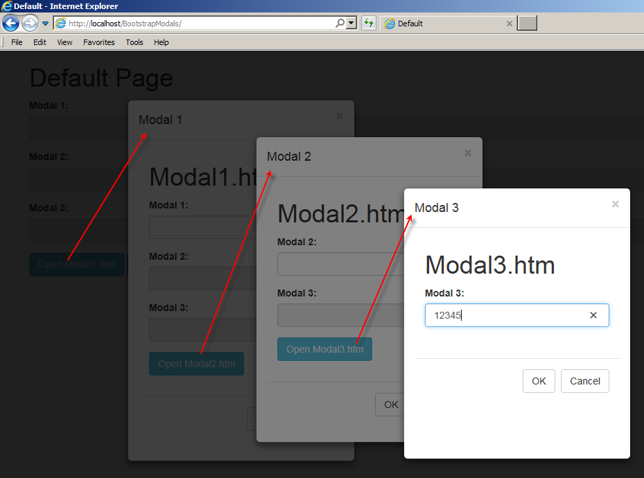

# Nested-Modal-Dialogs-using-Bootstrap

Originally posted here:
https://www.codeproject.com/Articles/1110966/Nested-Modal-Dialogs-using-Bootstrap

This project will show how to create nested modals.

## Introduction
The goal of this project is to show how to create nested modals. Each modal is created from another page using an iframe. This approach lets you dynamically load as many modals as you need. Unzip bsModal.zip to a firtal directory and point your browser to Default.htm.

Most code is contained in BsModal.js file. This file will let you:

1. Open a URL in a modal dialog using iFrame
2. Create nested dialogs
3. Show spinner while the page loads
4. Open an external page in full screen dialog
5. Move the modal dialog around the page

The code uses three external libraries:

1. jQuery (1.12.3)
2. Bootstrap (3.3.6)
3. Font-awesome (4.4.0)

## Using the Code

To use this code, include BsModal.js file in the page that creates the first dialog. The key function is ShowModal(). It accepts the following parameters:

- sUrl	URL of the page to be loaded
- iWidth	width of the modal. Optional. When bank window width will be used
- iHeight	height of the modal. Optional. When bank window height will be used
- oWin	windows object of the calling modal page. Optional

From the main page (Default.htm) ShowModal() function can be used like this:

`
 <input type="button" class="btn btn-info" value="Open Modal1.htm" 
  onclick="ShowModal('Modal1.htm',300,430)">
`
From a dialog page, the ShowModal() function can be used like this:

`
 <input type="button" class="btn btn-info" value="Open Modal2.htm" 
  onclick="parent.ShowModal('Modal2.htm',300,350,window)"> 
`
  
A modal dialog can close by calling HideModal() function like:

`
<button type="button" class="btn btn-default" onclick='parent.HideModal()'>Cancel</button> 
`
